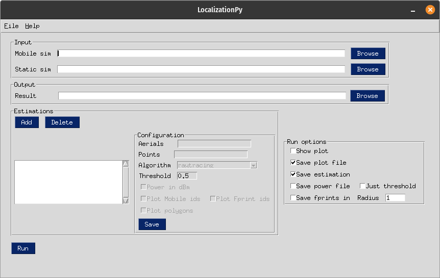
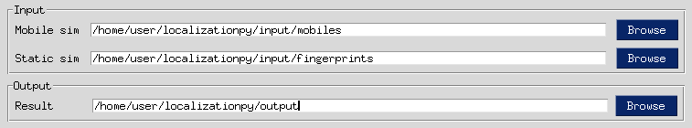
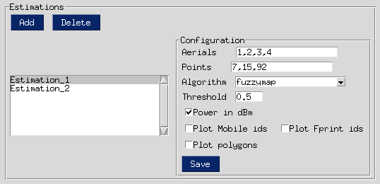
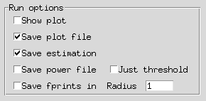
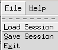

.. _gui:

Interfaz gráfica
===============================================
La interfaz gráfica del programa, provee acceso
sencillo a las funciones implementadas en la libreria para
generar estimaciones de forma inmediata y visual, permitiendo
establecer determinadas variables generales para la ejecución y
específicas para cada estimación por separado.

Dicha interfaz, podría desglosarse en cuatro secciones:

.. contents::
    :depth: 1
    :local:

.. _io_paths_gui:

In/output paths
---------------

Esta sección especifica las rutas a las carpetas que contienen los resultados de las simulaciones realizadas
con el programa New Fasant que se utilizarán como entrada para realizar las estimaciones y el directorio de
salida en el que se almacenarán los resultados obtenidos durante el análisis de dichas simulaciones.

.. note:: Ambas rutas de entrada, esperan una carpeta con la siguiente estructura:

    .. image:: images/gui/input_folder_tree.png

    Donde los archivos con extensión ".cer", definen los valores de campo electro-magnético para cada antena
    y punto. El fichero con extensión ".dat", contiene las coordenadas de dichos puntos empleados durante la
    simulación.

.. _estimations_gui:

Configuración de estimaciones
-----------------------------
En este apartado, se añaden cada una de las estimaciones que se desean obtener para una misma ejecución.
Las gráficas resultado irán concatenadas en una misma ventana (con el objetivo de que
se puedan comparar con facilidad) y todos los ficheros irán a parar a la misma carpeta (la especificada como ruta de
salida en :ref:`io_paths_gui`).

El panel está compuesto por una serie de campos definidos a continuación:

#. **Botón "Add"**: Añade una nueva estimación a la lista.
#. **Botón "Delete"**: Borra la estimación seleccionada de la lista.
#. **Lista de estimaciones**: Contiene las configuraciones de todas las estimaciones para la ejecución.
#. **Configuración de la estimación**: Sub-panel con los parámetros específicos de cada estimación.
    #. **Aerials**: Lista separada por comas que especifica qué antenas se usarán en la estimación. Cada antena se representa por su identificador, que coincide con el reflejado en el nombre del archivo correspondiente ".cer". Si ninguna antena se especifica (recuadro vacío), se emplearán todas.
    #. **Points**: Lista separada por comas que especifica qué puntos móbiles se usarán en la estimación. Cada punto se representa por un identificador asignado en el momento de leer el fichero ".dat". Si no se especifica ningún punto, se emplearán todos.
    #. **Algorithm**: Técnica a emplear en la estimación (ray-tracing o fuzzymap).
    #. **Threshold**: Umbral de estimación, solamente aplicable a la técnica de fuzzymap.
    #. **Power in dBm**: Utilizar potencias en dBm durante la estimación.
    #. **Plot Mobile ids**: Añade los identificadores de cada móvil a la gráfica de la estimación.
    #. **Plot Fprint ids**: Añade los identificadores de cada huella que compone el polígono de decisión a la gráfica de la estimación.
    #. **Plot polygons**: Añade los polígonos de decisión utilizados para cada punto estimado a la gráfica de la estimación.
    #. **Botón "Save"**: Guarda la configuración modificada de la estimación para que sea aplicada durante la ejecución.

    .. note:: Se recomienda utilizar las opciones 6, 7, 8 solamente cuando se utilicen pocos puntos en la
        estimación, ya que pueden añadir mucho ruido a las gráficas.

.. _run_options_gui:

Opciones de ejecución
---------------------
Permite establecer parámetros generales de la ejecución, aplicándose a todas las estimaciones configuradas en la
sección correspondiente (ver :ref:`estimations_gui`).

El panel dispone de las siguientes opciones:

#. **Show plot**: Crea una ventana de `Matplotlib <https://matplotlib.org/stable/api/_as_gen/matplotlib.pyplot.html#module-matplotlib.pyplot>`_ con las gráficas generadas para las estimaciones obtenidas que permite mayor visibilidad de las mismas.
#. **Save plot file**: Crea un fichero al final de la ejecución con las gráficas obtenias para las estimaciones.
#. **Save estimation**: Crea un fichero ".csv" para cada estimación con la información sobre cada punto estimado.
#. **Save power file**: Crea un fichero ".csv" para cada estimación con información sobre las potencias por punto estimado.
#. **Just threshold**: Aplica un umbral al fichero de potencias para que solo se almacenen las de aquellas huellas que caen dentro del mismo. Solamente aplicable a la técnica fuzzymap.
#. **Safe fprints in radius**: Crea un fichero ".csv" para cada estimación con información sobre las huellas cercanas a cada móvil a estimar. El campo "Radius" determina el radio elegido (en metros) en el que obtener las huellas.

.. _toolbar_gui:

Barra de herramientas
---------------------

Este panel contiene actualmente dos opciones bajo la pestaña "File" que cabe destacar:

#. **Load Session**: Guarda la configuración de la sesión actual.
#. **Save Session**: Carga la configuración de una sesión previamente guardada.
