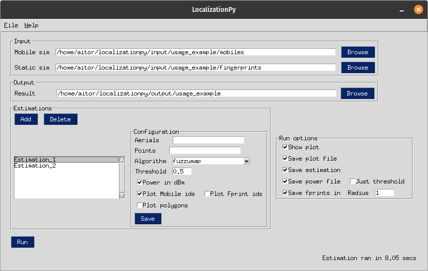
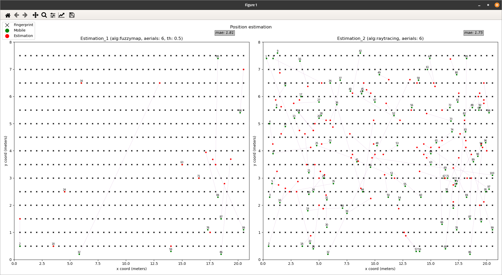
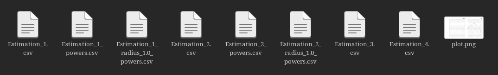

.. _usage:

Uso del programa
===============================================
En esta sección se explicará en líneas generales los usos que pueden hacerse
del programa, dando por sentada familiaridad con la interfaz gráfica.
Para una descripción detallada de dicha interfaz, véase la sección específica :ref:`gui`.

.. _usage_config:

Configuración
-------------
Al ejecutar la aplicación, los campos de configuración aparecerán vacíos y ninguna estimación programada.

En primer lugar, se seleccionarán las carpetas que contienen las simulacines de campo electromagnético para
los puntos que representan los móviles y para las huellas (indicar la carpeta errónea en este apartado
devolverá errores en la ejecución), además de la carpeta de salida de los resultados.

Una vez hecho esto, se pueden añadir estimaciones a la ejecución utilizando el botón "Add" correspondiente.
Las gráficas de todas las estimaciones añadidas a la lista, serán añadidas a la misma ventana para una rápida
comparación.
Para configurar cada estimación, basta con hacer click sobre la misma en la lista y modificar sus parámetros
como sea necesario.

.. note:: Cualquier cambio realizado sobre la configuración de una estimación, no será aplicado si no se hace click
    sobre el botón "Save" del sub-panel "Configuration".

Una ejecución simple podría tener este aspecto:

En este caso se realiza una comparación entre el algoritmo clásico basado en ray-tracing
y el que emplea fuzzy-map (con un threshold de 0.5).

Una vez ejecutado, si se ha seleccionado la opción "Show plot" en el sub-panel :ref:`run_options_gui`,
aparecerá una ventana de `Matplotlib <https://matplotlib.org/stable/api/_as_gen/matplotlib.pyplot.html#module-matplotlib.pyplot>`_
con las gráficas generadas.

En caso contrario, se guardarán los ficheros de la estimación que se hayan indicado en las :ref:`run_options_gui`.

.. note:: El programa queda inutilizable mientras la ventana con las gráficas esté abierta.

.. _res_files_desc:

Descripción de ficheros resultado
---------------------------------
Una vez completada la ejecución, el programa creará una serie de archivos.

Los ficheros con extensión ".csv" corresponden a resultados númericos con información sobre varios campos mientras que
el ".png", simplemente contiene una captura de las gráficas generadas para todas las estimaciones.

En el caso del archivo "plot.png", se representan pares de puntos móvil-estimación, unidos por una línea para mayor claridad
visual. En los títulos de dichas representaciones, se añade información básica sobre la técnica utilizada, el número
de antenas, etc. Además, se refleja el error medio absoluto (mae) de todos los puntos estimados, como indicador final
del desempeño del algoritmo.

Los grupos de resultados son generados para cada estimación añadida y contienen la siguiente información:

 * **Estimation_X**. Contiene los resultados generales de cada estimación. Su número de entradas corresponde al número de móviles utilizados en la simulación.

     #. **Original point**. Punto móvil real a estimar.
     #. **Estimated point**. Punto estimado para el móvil correspondiente mediante el algoritmo elegido.
     #. **Number of estimation fingerprints**. Número de huellas utilizadas en el polígono de decisión.
     #. **Estimation fingerprints**. Listado de huellas empleadas para realizar la estimación (vertices del polígono de decisión).
     #. **Error**. Error en metros entre el punto real y el estimado.

 * **Estimation_X_powers**. Listado de las potencias consideradas para hacer los cálculos relativos a la estimación. Se añade una entrada por cada potencia calculada para una tupla huella-antena.

     #. **Mobile**. Posición del móvil real.
     #. **Fingerprint**. Huella.
     #. **Aerial**. Identificador de la antena.
     #. **Mobile power**. Valor de potencia en el móvil.
     #. **Fingerprint power**. Valor de potencia en la huella.

 * **Estimation_X_radius_R_powers**. Este fichero es idéntico a "Estimation_X_powers" en cuanto a columnas, con la excepción de que las potencias que aparecen son las correspondientes a huellas cercanas (dentro del radio R especificado) al móvil.